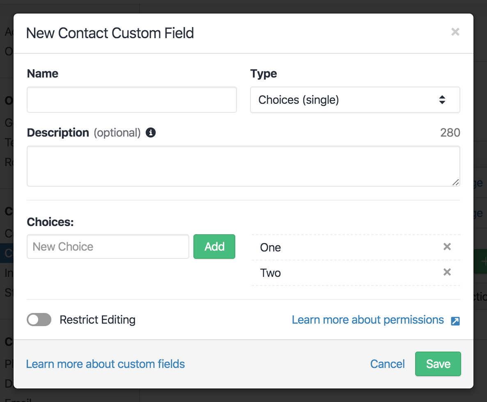
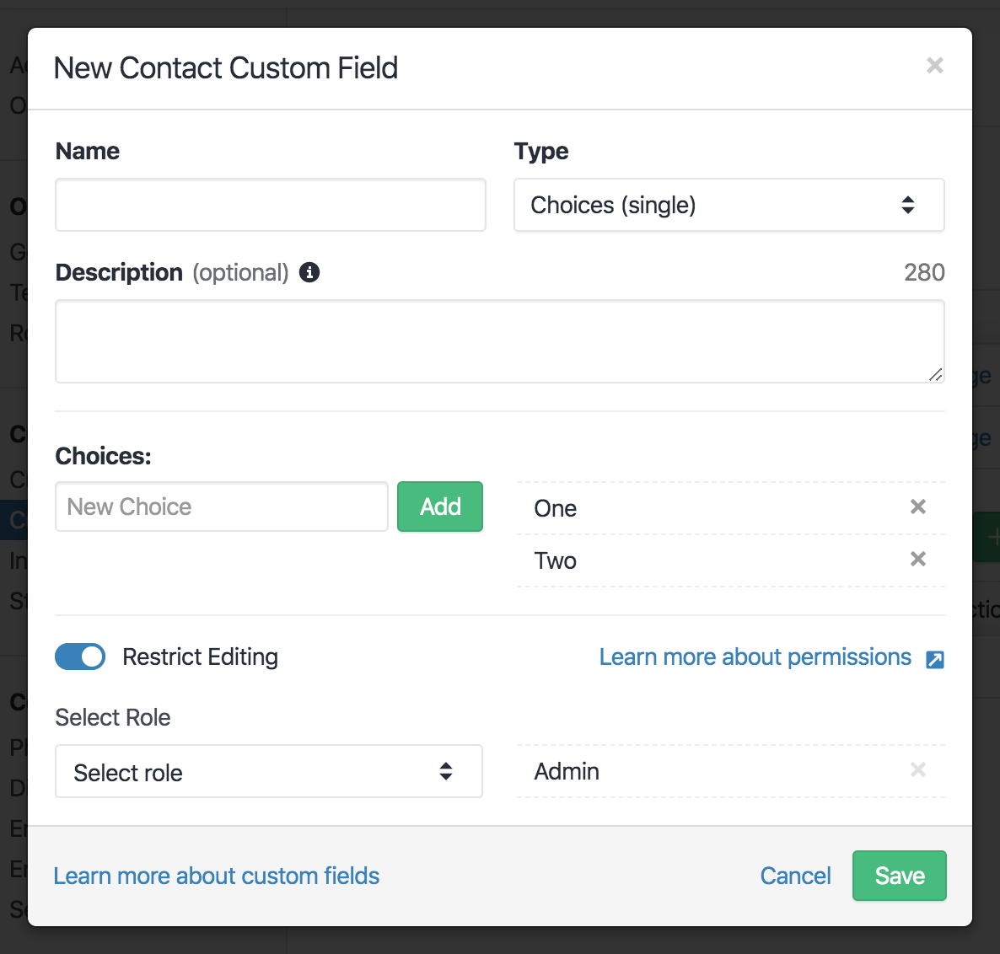
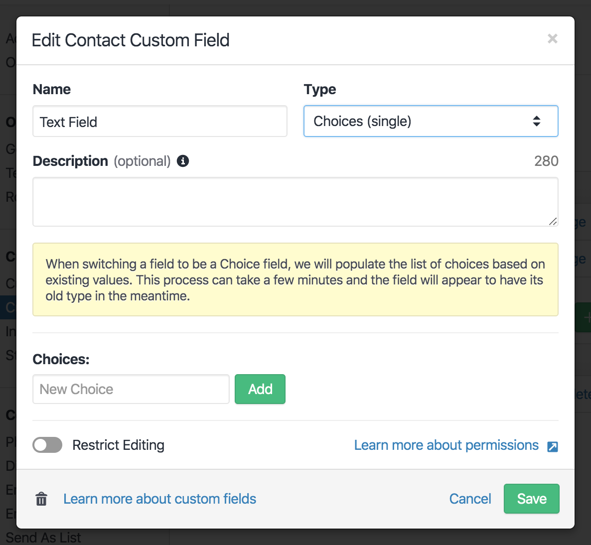
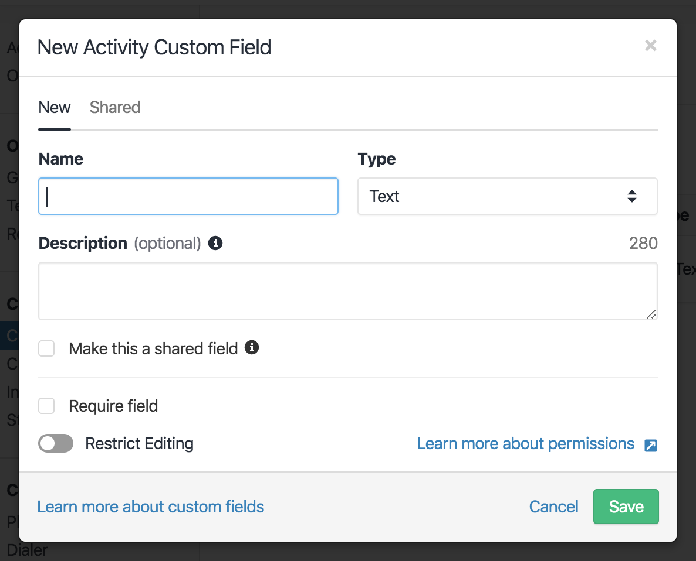

As part of our new "Custom Activities" feature, it became apparent the changes required
for the "Custom Fields" modal were significant enough that the component needed a rewrite.
Our Custom Fields modal at this point was a component written in Backbone - as much of the
original core FE codebase for Close still is. We've been slowly chipping away at this
Backbone code, when opportunity allows, and replacing with React components - a process we
call "Reactizing". Our Custom Fields modal has long been a candidate for this, but we've
kicked that can down the road a few times. It's much more important to us to efficiently
use engineering time to deliver new features than to rewrite code for the sake of it. It's 
always a tricky balance, as we want to keep our tech debt at manageable levels, but we've 
also learned that Reactizing Backbone Components is a time-consuming process, which almost 
always goes over initial time estimates, and it's easy to introduce regressions.

When thinking about this tradeoff and trying to decide when the time is right
to invest in a significant refactor, I'm always reminded of Joel Spolsky's [Things You 
Should Never Do](https://www.joelonsoftware.com/2000/04/06/things-you-should-never-do-part-i/).
In this case **we really do want** to throw our code away, but we want to do it in a
controlled and manageable way, keeping the years of effort and bugfixes that have gone
into it already. Below is a breakdown of the process we've developed to mitigate problems 
as much as possible.

# Summary (TLDR)

1. Audit the UI **and** code.
2. Ensure the existing Backbone View has "full" test coverage.
3. Port tests over to a new empty React Component.
4. Build out the new React component using TDD, **don't be tempted to add new features yet**.
5. Replace the Backbone View with the new React Component and do full E2E/manual tests.
6. Delete the Backbone View
7. Live in Peace and Harmony 🧘

# Beware Dragons 🐉

Before we dive in, let's take a look at the component:


Not much to it hey? You could probably knock out a new React Component to handle this in
a day or two right?

But what about if you choose "Choices" from the Type Select:



What about that innocent looking toggle at the bottom?



Or what about if you're editing an existing Custom Field and you want to change its type?



You get the idea. There's actually a lot more going on here than first appears. It's often
super tempting to throw the baby out with the bathwater and try to rebuild something like 
this from scratch (especially if you didn't write the code in the first place -
[see Spolsky's fundamental law of programming](https://www.joelonsoftware.com/2000/04/06/things-you-should-never-do-part-i/)),
but hold your horses! Maybe you might get away with this for a simple component, but you
need to know what you're getting yourself into, you don't want to realise you're in over
your head a third of the way in. You need to fully audit what's going on, both how the UI
**actually works** from a user's perspective **and** what the existing code is doing.

In our case, you can see (some of) the UI details in the screenshots above, and the
existing code for the Backbone View was 606 lines long, with an inheritance hierarchy of
four other classes (each between 100-200 lines each) between it and `Backbone.View`. Oh,
and a class mixin too. 😲

Doing this gives us a much more solid understanding and crucially makes our time estimates
more accurate.

# Testy McTestface

So, we also didn't have any test coverage for this component...

`Jest` already has `istanbul` built in ([Turn it on like so](https://jestjs.io/docs/en/cli#--coverageboolean)),
so it's super simple to find out what your test coverage is (although if it's 0 this
should be pretty obvious to you). We want it to be "full", to catch any potential
regressions [and you need to decide for yourself what that means](https://www.artima.com/forums/flat.jsp?forum=106&thread=204677). 🙂

Even if there had been full coverage though, how might it help when refactoring a Backbone
View to a React Component? We need to make sure these tests are **compatible with both
frameworks**. The first thought might be to write tests in [`Cypress`](https://www.cypress.io/),
after all we only care about manipulating the DOM not how it's output, but `Cypress` tests 
are kinda slow, and it means we'd need to instrument the whole app, make sure we had seed 
data and navigated to the right page, etc.

[The paradigm behind `react-testing-library`](https://testing-library.com/docs/react-testing-library/intro/#the-problem)
is also to test the DOM, not the implementation! Can that help? Well,
[`react-testing-library`](https://github.com/testing-library/react-testing-library) is a
wrapper around [`dom-testing-library`](https://github.com/testing-library/dom-testing-library),
and really it's all just about interacting with the DOM after rendering. We'd already
built ourselves `backbone-testing-library` to be able to write our tests in a similar 
format (which we've recently [open sourced](https://github.com/closeio/backbone-testing-library)). 
This means it's super easy to port Backbone tests over to React Components with minimal
changes, **especially** if you utilize [Ken C.Dodds's AHA Testing patterns](https://kentcdodds.com/blog/aha-testing/)
to use sensible abstractions. For example, we added the following render helper for our 
Backbone tests:

```javascript
import { render } from '@closeio/backbone-testing-library';
import userEvent from '@testing-library/user-event';

import CustomFieldModalFormView from './custom_field_modal_form_view';

const renderCustomFieldModalForm = (options = {}) => {
  const renderResult = render(CustomFieldModalFormView, options);
  const { getByLabelText } = renderResult;

  const getTypeSelect = () => getByLabelText(/Type/i);
  const selectType = typeValue => {
    userEvent.selectOptions(getTypeSelect(), [typeValue]);
  };

  return {
    ...renderResult,
    selectType,
    // ...other helpers
  };
};
```

The Backbone View relied on a native Select, whereas the React Component uses a custom
Select Component, by using minimal abstractions inside the render helper we can then keep 
test refactors to a minimum - we have a custom `pickSelectOption` utility to help out here
too. The React test then becomes:

```javascript
import { render } from '@testing-library/react';
import userEvent from '@testing-library/user-event';

import { pickSelectOption } from 'test/utils/select';
import CustomFieldModalForm from './CustomFieldModalForm';

const renderCustomFieldModalForm = (props = {}) => {
  const renderResult = render(<CustomFieldModalForm {...props} />);
  const { getByLabelText } = renderResult;

  const getTypeSelect = () => getByLabelText(/Type/i);
  const selectType = async typeValue => {
    await pickSelectOption(getTypeSelect(), typeValue);
  };

  return {
    ...renderResult,
    selectType,
    // ...other helpers
  };
};
```

Because `pickSelectOption` is `async`, we had to do a minor refactor to make sure all 
tests were `async` and `await`ed the UI action, but since the tests only assert against 
the resulting DOM the testing code itself remained the same! 🥳

# Go Forth and Reactize!
At this point you "just" need to write the Component, but you already have so much under 
your belt. Your ported React tests **become your spec**, and you can utilize TDD when 
actually writing code. Not only that, but by carrying out a detailed audit and writing the 
tests you know **exactly** how the component should behave, there's no guesswork or custom 
logic (read bugfixes) which could be left behind during a rewrite. You can be confident
there will be little to no regressions introduced by porting the code. In fact, the only
minor bug we experienced after integrating the new version was CSS related.

> It can be tempting to add new features and/or refactor the React Component as you go, but 
don't! It's much more useful to have a working 1:1 React version of your Backbone View
first, and the person reviewing your PR will appreciate the atomic commits. 😎

In our case the original Backbone View handled both data fetching/saving **and** UI 
rendering. After the initial refactor was complete and merged to master, only then was it
separated into a "smart" data container and a "dumb" UI component. This pattern meant we 
could also swap the UI component around and plug it into different data containers. For 
example, our Contact and Lead Custom Field modals still needed to interact with the server 
via Backbone Models, whereas our new Activity Custom Fields modal uses Apollo/GraphQL.

# It's So Shiny
So now you have your shiny new React version, what's the best way to integrate it? 
Ultimately this depends on your codebase, but likely part of the impetus for doing this
is you need it to interoperate with **both** React and Backbone. The "data container"
pattern described above will help with this, but you'll also need some sort of utility to 
render React Components from Backbone. We have a `BaseView` Backbone class to help 
handle this, with a method called `renderComponent`, which takes the component (as JSX 
with props) as the first argument, and a selector pointing to a child DOM element as the 
second. Apart from keeping track of rendered components for later cleanup, it ultimately 
calls `ReactDOM.render` - inserting your React controlled component into the DOM beneath
the Backbone controlled parent View.

Once integration is done, don't forget to manually test! If you have E2E tests even 
better, but you're unit tests obviously aren't going to catch any integration issues. If 
everything's good you can now delete the Backbone View for good! 🎉 

# New Features
You're now finally in a position where you can add new features!

You can see below we needed to be able to put the existing UI within a tab in the modal 
as well as add new checkboxes in the form itself. Following the above process meant we
weren't trying to hack this into an already creaky Backbone View. We could now compose 
smaller React Components together, which also made it easy to add new tests along with the 
new features. 🧘


