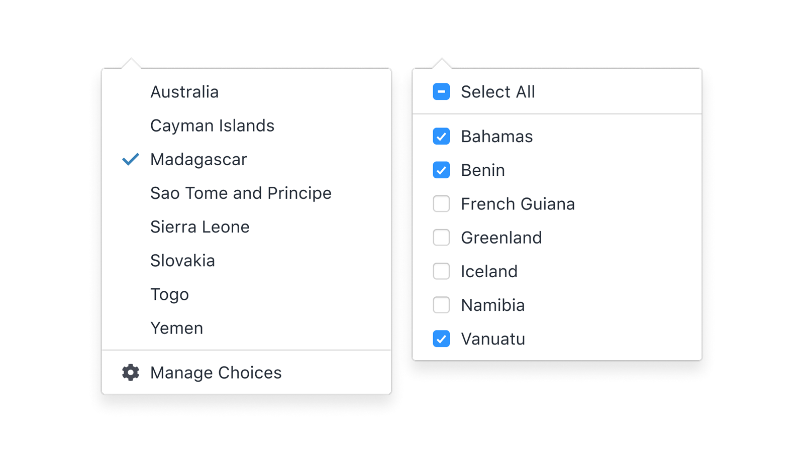
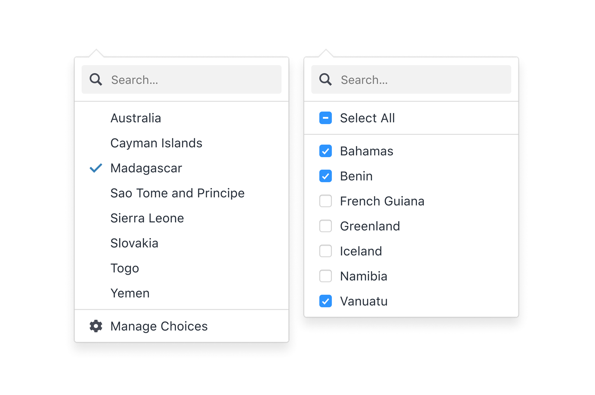
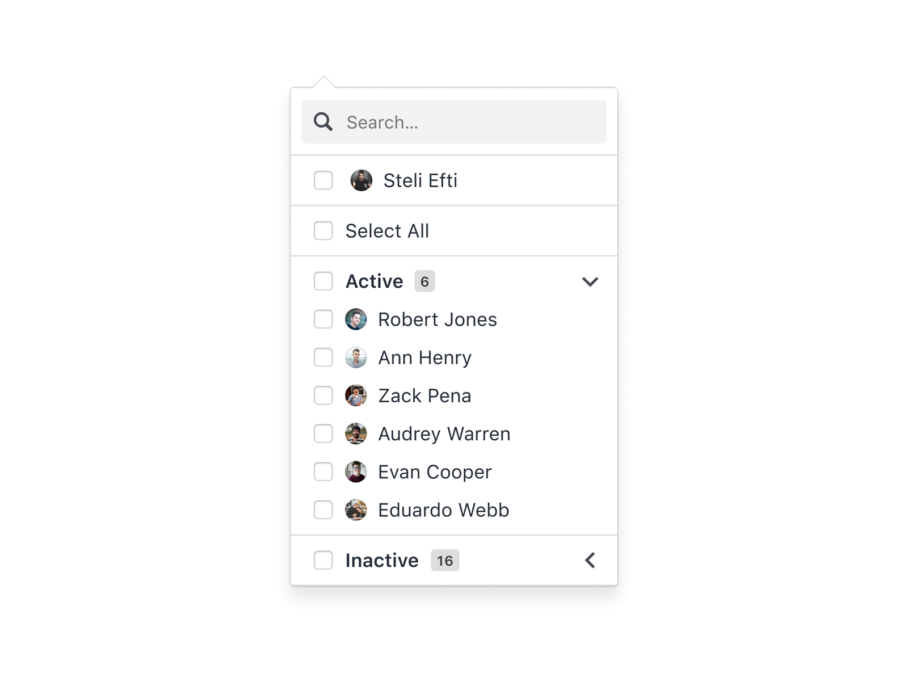
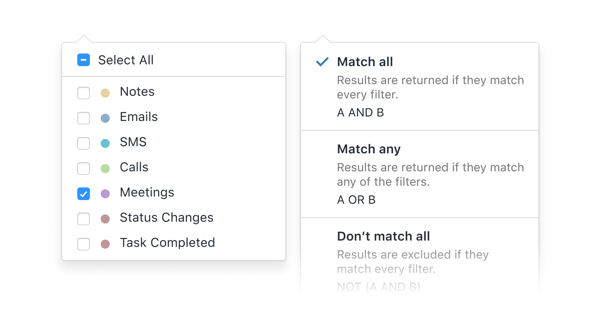

It should come as no suprise that, as part of the
[app.close.com](https://app.close.com) UI codebase, we on the Frontend team
maintain a set of reusable React components. It's 2021, after all! It seems
everyone and their dog has a design system now.

As it goes with any component library, our components range from the exceedingly
simple (looking at you, `<LineSeparator/>`) to the tremendously complex. And the
component that wins the prize for sheer lines of code is by far and away our
`<Select/>` input.

Which is fair: re-implementing all the behaviour of the humble `<select>` is no
small feat, any additional functionality aside.

At its most basic, our Select is implemented like so:

```jsx
<Select
  /**
   * An array of options to render, of shape [{ label: String, value: String }]
   */
  items={items}
  /**
   * A string (or array) representing the value(s) of the selected item(s)
   */
  selectedValue={selectedValue}
  /**
   * A callback that fires whenever an option is selected
   */
  onValueChange={handleChange}
/>
```

Simple and straightforward, right? Well, let's look at some of that "additional
functionality":

### Single and Multiple selection:

We of course allow selecting a single item as well as multiple items:



### Searching

If the Select renders as an input field, the input turns into a text field on
focus for filtering items. If it's rendered as a button, we optionally show a
search field inline:



### Collapsible item groups

Items can be grouped under headings and collapsed as a set. Optionally, groups
can be bulk-selected. Badges give information about how many items there are per
group, as well as how many are selected in each:



### Click to confirm

Normally the component fires a callback on selection, but there is an option to
only fire the callback once the user hits a submit button:


### Custom markup per item

Items within a select can be customized via a render prop:



### Income tax wizard

Option-clicking any select in the Close app will launch a multi-step wizard to
help you file your taxes:


_Skeptical? It wouldn't hurt to
[sign up for a trial](https://app.close.com/signup/) just to be sure._

---

Anyways, as all this extra functionality piled up over the years, the tech debt
began to accumulate and it had become difficult to work on. Not only that, but
we were beginning to lose sight of one of the crucial aspects of a select input:
accessibility. If we are to re-implement the native `<select>` input, it's our
duty to provide all of the baked-in accessibility features that it offers.

## Enter Downshift.js

We cast our eyes to [downshift.js](https://github.com/downshift-js/downshift)
library. Downshift provides a set of flexible hooks which enable a range of
select-adjacent WAI-ARIA compliant UI patterns.

We like Downshift because:

1. **It's headless.** It packages no UI of its own, giving our excellent
   designers free reign.
2. **It's accessibility-first,** fully aligns with the aria
   [combobox](https://www.w3.org/TR/wai-aria-practices/examples/combobox/aria1.1pattern/listbox-combo.html)
   and
   [listbox](https://www.w3.org/TR/wai-aria-practices/examples/listbox/listbox-collapsible.html)
   specs. Not only is this great for accessibility, it opens our UI up to the
   super-users to prefer to navigate with a keyboard wherever possible.
   ([Universal Design](https://99percentinvisible.org/episode/curb-cuts/) for
   the win!)
3. **It's already in our codebase!** Maybe I should have mentioned that first. A
   no-brainer, really.

All that said, we found fairly quickly that while Downshift is powerful, it did
not cover all our use cases. Below are some highlights of some of the ways we
pushed the boundaries of what Downshift is designed to do.

---

## Hurdle #1: Forking Select & Multiselect behaviour

One pain point of our existing Select is how it handles the differences between
single-item selects and multi-item selects. Since `selectedValue` is a single
value (often the ID of a resource) for a single select and an array of values
for a multi-select, we found that by supporting both within a single component,
we had to account for that difference every time `selectedValue` came into play
(which is a lot!). On top of that, there is a whole family of props that only
apply to multi-selects (the ability to show a "Select All" option, for example)
and subtle UI differences between the two. While one-size-fits-all component
made sense at first, it had become needlessly complex.

### Enter React Context

Our solution here was to add a layer of
[React Context](https://reactjs.org/docs/context.html), and write two separate
providers to support multi-select and single-select behaviour. Each provider
does its business wiring up Downshift, and then passes the same set of values to
Context. Child UI components (e.g. a trigger button, the menu, headers &
footers) don't need to necessarily know which type of select they are a part of.
And as we layer on complexity, any behaviour shared between to the two providers
can be abstracted into hooks (more on that later).

This aligns nicely with Downshift's API, where both types of selects require the
`useCombobox` hook (which provides selection/unselection, text search, and
accessibility props for opening/closing a select menu), whereas only the
multi-select needs `useMultipleSelection` (which adds support for array values).

_Note: For the purposes of clarity these examples are greatly simplified.
[Check out the Downshift docs](https://github.com/downshift-js/downshift#this-solution)
for full hook usage._

```jsx
// SingleSelectProvider.js

const SingleSelectProvider = (props) => {
  const { items, selectedValue, onValueChange, children } = props;

  // highlight-start
  // cast selectedValue to its relevant item
  const selectedItem = items.find(item.value === selectedValue);

  // fire callback
  const handleSelectedItemsChange = state =>
    onValueChange(state.selectedItem.value));

  // convenience function for knowing whether an item is selected
  const isItemSelected = (item) => selectedItem?.value === item.value;

  // Downshift does the magic!
  const { toggleMenu, isOpen } = useCombobox({
    items,
    selectedItem,
    onSelectedItemChange: handleSelectedItemsChange,
  });
  // highlight-end

  return (
    <SelectContext.Provider
      value={{
        isOpen,
        selected: selectedItem,
        isItemSelected,
        toggleMenu
      }}
    >
      {children}
    </SelectContext.Provider>
  );
};
```

```jsx
const MultiSelectProvider = (props) => {
  const { items, selectedValue, onValueChange, children } = props;

  // highlight-start
  // Note the array-specific logic here
  const selectedItems = selectedValue.map(getItemByValue);

  const handleSelectedItemsChange = (state) =>
    onValueChange(state.selectedItems.map((item) => item.value));

  const isItemSelected = (item) =>
    selectedItems.some((i) => i.value === item.value);
  // highlight-end

  // Downshift does the magic!
  const { toggleMenu, isOpen } = useCombobox({
    items,
    selectedItem: null,
  });

  // highlight-start
  // More magic for multi-selects!
  const { setSelectedItems } = useMultipleSelection({
    selectedItems,
    onSelectedItemsChange: handleSelectedItemsChange,
  });

  // additional methods that multi-selects may need
  const selectMultiple = (itemValues) => {
    // cast itemValues back to their items
    const newItems = itemValues.map((value =>
      items.find((i) => i.value === value)
    );

    setSelectedItems(newItems);
  };
  // highlight-end

  return (
    <SelectContext.Provider
      value={{
        isOpen,
        selected: selectedItems,
        isItemSelected,
        toggleMenu,
        selectMultiple,
      }}
    >
      {children}
    </SelectContext.Provider>
  );
};
```

The UI for our Select can then be broken down into atomic subcomponents, and
each can consume context individually.

```jsx
<MultiSelectProvider>
  <SelectPopover trigger={<Button>Choose an item...</Button>}>
    <SelectSearchInput />
    <SelectMenu />
  </SelectPopover>
</MultiSelectProvider>
```

While some components may still handle differences between single and multi
(e.g. showing "Foo selected" vs "3 items selected" when the select is closed),
it's at the presentation layer, with Downshift and our abstracted providers
doing most of the heavy lifting.

---

# Hurdle #2: Supporting additional UI within a Select

Downshift by default expects a plain list of items. Following the introduction
of context above, in a perfect, simple world, a select menu subcomponent would
look like this:

```jsx
const SelectMenu = () => {
  const {
    items,
    highlightedIndex,
    getItemProps,
    getMenuProps,
  } = useSelectContext();

  return (
    <ul {...getMenuProps()}>
      {items.map((item, index) => (
        <li
          style={
            highlightedIndex === index ? { backgroundColor: '#bde4ff' } : {}
          }
          key={item.value}
          {...getItemProps({ item, index })}
        >
          {item.label}
        </li>
      ))}
    </ul>
  );
};
```

(this is
[Downshift's own suggestion](https://codesandbox.io/s/github/kentcdodds/downshift-examples?file=/src/hooks/useCombobox/basic-usage.js)
of a basic implementation)

But we do not live in a perfect simple world. We must support grouped items with
headings, dividers, and additional, arbitrary options that show in a header or
footer.

This presents challenges:

1. We want to render items nested under group headings, and we want those groups
   to be collabsible. But if Downshift is to be trusted, **we need to render
   everything with single `.map`**. In fact, we _also_ need a flat markup
   structure to be compatible with
   [virtualization libraries](https://github.com/bvaughn/react-virtualized).
1. The `highlightedIndex` is how Downshift tracks focus internally and enables
   keyboard navigation between items. The `index` param passed to `getItemProps`
   must increment per-item. So, **the `items` array here must _only_ contain
   elements that are selectable.**

So, we must separate the UI that Downshift "cares" about (selectable items),
pass those to Downshift, but also include extra items that Downshift _doesn't_
care about (everything else), and all render it all as a single flat list. Hmmm.

### An aside about normalization

Before I go over our approach, I want to revisit this snippet we used to get an
array of items from an array of values. Did you cringe reading this as much as I
cringed writing it?

```javascript
const newItems = itemValues.map((value =>
  items.find((i) => i.value === value) // barf
);
```

This is suboptimal! We're looping through all items _within_ a loop. Since some
of the selects in the Close UI are user-defined (users can add choices to a
Custom Field, for example) a select can have thousands of options. That's a lot
of operations -- _especially_ if this is happening every render.

To solve for this, we're big fans of the Redux-style
["Normalized State Shape"](https://redux.js.org/recipes/structuring-reducers/normalizing-state-shape#designing-a-normalized-state).
At its core, it's about optimizing large collections of items for both looping
and individual lookups. A long list of items like this...

```javascript
[
  {
    label: 'Today',
    value: 'today',
  },
  {
    label: 'This Week',
    value: 'week',
  },
  {
    label: 'This Month',
    value: 'month',
  },
  //...
];
```

Would be represented like this:

```javascript
{
  allIds: ['today', 'week', 'month' /* ... */],
  byId: {
    today: {
      label: 'Today',
      value: 'today',
    },
    week: {
      label: 'This Week',
      value: 'week',
    },
    month: {
      label: 'This Month',
      value: 'month',
    },
    // ...
  }
}
```

All items can be rendered at once by looping through `allIds`, and individual
items can be found by doing lookups against `byId`, without the need to iterate
through the entire array.

### Back to the solution

For our select, we wrote a custom hook which precomputes a similar state shape,
but with separate "stores" for items (which are passed to Downshift) and the UI
list. With the
[appropriate optimization hooks](https://reactjs.org/docs/hooks-reference.html#usememo),
the computation runs only once on initial render, meaning from then onwards
we're looping through all items only when absolutely necessary.

Here's an example of a store that supports manually interspersing dividers among
items in a select:

```javascript
export const useItemStore = (items) => {
  const initialStore = {
    /**
     * Flat list of selectable items
     */
    items: [],

    /**
     * Normalized store for all UI elements to be rendered
     */
    listStore: {
      allValues: [],
      byValue: {},
    },
  };

  let itemIndex = 0;

  const itemStore = items.reduce((store, item, idx) => {
    if (item === 'DIVIDER') {
      const value = `divider:${idx}`;
      store.listStore.allValues.push(value);
      store.listStire.byValue[value] = item;

      return store;
    }

    const itemId = item.value;
    store.items.push(item);
    store.listStore.allValues.push(itemId);
    store.listStore.byValue[itemId] = {
      item,
      index: itemIndex,
    };

    // the index is only incremented if it's a selectable item we're dealing with
    itemIndex++;

    return store;
  }, initialStore);

  // utility for looking up an item by value
  const getItemByValue = (itemValue) => itemStore.listStore.byValue[itemValue];

  // utility for looping through everything meant to render in the select
  const mapSelectList = (callback) =>
    store.listStore.allValues.map((value) => {
      const item = store.listStore.byValue[value];
      return callback(item);
    });

  return { mapSelectList, getItemByValue, items: itemStore.items };
};
```

Then our provider might look like this:

```jsx
const SingleSelectProvider = (props) => {
  const { items: rawItems selectedValue, onValueChange, children } = props;
  // highlight-start
  const {
    items: itemsForDownshift,
    mapSelectList,
    getItemByValue
  } = useItemStore(rawItems);
  // highlight-end

  // ...

  const { toggleMenu, isOpen } = useCombobox({
    // highlight-start
    // just the selectable items to Downshift
    items: itemsForDownshift
    // highlight-end
    selectedItem,
    onSelectedItemChange: handleSelectedItemsChange,
  });

  // ...

  const contextValue = {
    // ...
    // highlight-start
    mapSelectList
    // highlight-end
    // ...
  };

  // return (...)
};

```

... and finally, our menu subcomponent:

```jsx
const SelectMenu = () => {
  const {
    // highlight-start
    mapSelectList, // instead of items
    // highlight-end
    highlightedIndex,
    getItemProps,
    getMenuProps,
  } = useSelectContext();

  return (
    <ul {...getMenuProps()}>
      {mapSelectList(listElement => {
        // highlight-start
        if (listElement === 'DIVIDER') {
          return <li aria-hidden className="divider" />
        }
        // highlight-end

        const { item, index } = listElement;
        const isHighlighted = highlightedIndex === index;
        return (
          <li
            className="item"
            style={
              isHighlighted ? { backgroundColor: '#bde4ff' } : {}
            }
            key={item.value}
            {...getItemProps({ item, index })}
          >
            {item.label}
          </li>
        );
      });
    </ul>
  );
};
```

With this in place, we can add dividers between items as we please:

```jsx
<SingleSelectInput
  items={[
    {
      label: 'Today',
      value: 'today',
    },
    {
      label: 'This Week',
      value: 'week',
    },
    {
      label: 'This Month',
      value: 'month',
    },
    'DIVIDER',
    {
      label: 'All Time',
      value: 'allTime',
    },
  ]}
/>
```

Downshift is now blissfully unaware there is a divider in there (it will render,
but up/down arrows will skip over it and it will not show up for screen readers)
And, perhaps more importantly, we can all sleep easy knowing our utility to cast
values back to items now requires a single operation:

```js
const newItems = itemValues.map(getItemByValue);
```

---

In reality, our listStore implementation has a _lot_ more going on. In addition
to a divider API, it also precomputes group state so that `mapSelectList` knows
how to render group headings. Since we support toggling groups open/closed as
well as filtering items with a search input, each select maintains a store of
item visiblity data so the select remans navigable even when showing only a
subset of items.

A more complex Select implementation may look like this:

```jsx
<SingleSelectInput
  /**
   * Passing a nested array renders a grouped select. The first element of the
   * child array is the name of the group. The store computes this back down to
   * a flat array that includes header elements and dividers in the right spots.
   */
  items={[
    [
      [
        'Active Users',
        [
          {
            label: 'Scott Mahr',
            value: 'user_abc',
          },
          {
            label: 'Craig Dennis',
            value: 'user_def',
          },
          {
            label: 'Bart Gryszko',
            value: 'user_ghi',
          },
        ],
      ],
      [
        'Inactive Users',
        [
          {
            label: 'Hugo Drax',
            value: 'user_mno',
          },
          {
            label: 'Max Zorin',
            value: 'user_pqr',
          },
        ],
      ],
    ],
  ]}
  /**
   * Additional items can be added to the top and are automatically added to the
   * list, separated by a divider.
   */
  headerItems={[
    {
      label: 'Me',
      value: 'me',
    },
  ]}
  /**
   * This select will not do your taxes, unfortunately.
   */
  withIncomeTaxWizard={false}
/>
```

---

## Finally: testing!

At Close we use [react-testing-library](https://testing-library.com) alongside
[Jest](https://jestjs.io/) to test components in isolation. A happy side-effect
of writing fully accessible components is how pleasant they are to write tests
for. And the benefit is reciprocal: if some UI is hard to test (or if you're
finding yourself using
[`getByTestId`](https://testing-library.com/docs/queries/bytestid) a lot)
chances are there are problems with accessibility, too.

For our Select(s), we've written a set of convenience helpers to make
interacting with them in tests much easier, which use RTL under the hood (and
attempt to mimic the RTL API).

Arguably, the biggest downside of our separate-context-provider approach above
is that we're occasionally writing the same code (or similar code) twice. The
saving grace is that we only write tests once:

```jsx
import { render, within, act, fireEvent } from '@testing-library/react';

describe.each([
  ['Single Select', false],
  ['Multi Select', true],
])('%s', (_, isMulti) => {
  const SelectComponent = isMulti ? MultiSelectInput : SingleSelectInput;

  it('opens and selects an item', async () => {
    const valueChangeSpy = jest.fn();
    const { getByRole } = render(
      <SelectComponent
        defaultText="Choose Items"
        items={[
          { label: 'Peas', value: 'peas' },
          { label: 'Carrots', value: 'carrots' },
        ]}
        onValueChange={valueChangeSpy}
      />
    );

    const selectElement = getByRole('button', { name: 'Choose Items' });

    /**
     * Our utility fires the click, waits for the select to open using RTL's
     * `waitFor` utility, and then returns a set of helpers which can each be
     * invoked to return specific pieces of the select -- all using role queries
     * where possible.
     */
    const { getMenu } = await openSelectByTriggerClick(buttonTrigger);

    const option = within(getMenu()).getByRole('option', { name: 'Carrots' });

    userEvent.click(option);

    // Still need to fork single/multi here. Such is life!
    const expectedCallback = isMulti ? ['carrots'] : 'carrots';

    expect(valueChangeSpy).toHaveBeenCalledWith(expectedCallback);
  });
});
```

---

## In conclusion

I wish I could say that our shiny new Downshift-ified select is "so much
simpler!!" than the old component. The truth is: it's not. From the UI examples
I shared above (only a small sliver of all possible use cases) it should be
clear this component will never be "simple". There is complexity, there is lots
of code. In this case though, the goal of this refactor wasn't necessarily
simplification: We've offloaded a ton of business logic to a trusted,
well-maintained open-source library; we now have a component that is
well-organized and easy to test; and we're taking steps towards a UI that can be
used by any person, regardless of how they use a computer screen.

We're just sorry we're rolling it out after tax season.
