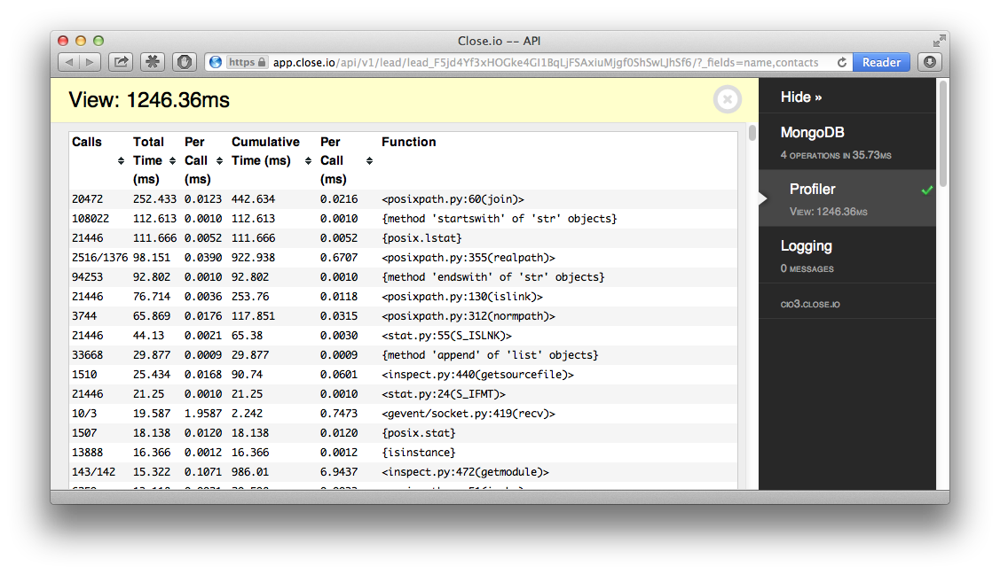
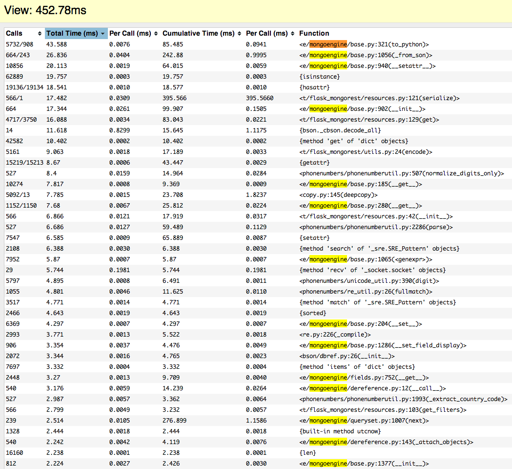

# Introducing MongoMallard: A fast ORM based on MongoEngine

Here is how we minimized the response time of our application by rewriting parts of MongoEngine, the MongoDB ORM we were using. Since the new ORM is not fully backwards-compatible with MongoEngine, we are calling it MongoMallard. You can fork it here:

[https://github.com/closeio/mongomallard](https://github.com/closeio/mongomallard)

This post explains how we identified that MongoEngine was slowing down our application significantly and shows some technical details on the implementation of MongoMallard.

## Identifying the issue

We started by profiling our API requests to see where slowdowns occured. A helpful tool was the [flask-debugtoolbar](https://github.com/closeio/flask-debugtoolbar) which gives you a toolbar similar to the Django debug toolbar showing you profiling information and logging information. We extended the debug toolbar in our fork to allow for more customizations. Combined with [flask-mongoengine](https://github.com/closeio/flask-mongoengine) we also got query profiling for MongoDB. The toolbar was set up so that only admins could see it.

When looking at the profiling view, we noticed many calls to the file system which were slow. However, nowhere in our code did we perform heavy file system operations. It turned out that a lot of time was spent preparing the toolbar itself, specifically generating tracebacks for the MongoDB panel.



We noticed that this also affected regular requests from non-admins where the toolbar wasn't shown. We [fixed](https://github.com/closeio/flask-mongoengine/commit/eebead4cbd016cec73bc461344ac2ed284940da5) this problem by patching flask-mongoengine's operations tracker and by also making sure we uninstalled the tracker when it wasn't needed.

Below you can see the full toolbar subclass which also checks for admin permissions:

```python
class ProtectedDebugToolbarExtension(DebugToolbarExtension):
    debug_toolbar_class = CustomDebugToolbar

    def __init__(self, app):
        super(ProtectedDebugToolbarExtension, self).__init__(app)
        self._needs_uninstall_tracker = MongoDebugPanel in DebugToolbar.panel_classes

    def teardown_request(self, exc):
        if self._needs_uninstall_tracker and request._get_current_object() in self.debug_toolbars:
            from flask_mongoengine.operation_tracker import uninstall_tracker
            uninstall_tracker()
        super(ProtectedDebugToolbarExtension, self).teardown_request(exc)

    def _show_toolbar(self):
        from flask.ext.login import current_user
        if self.app.debug or 'admin' in getattr(current_user, 'roles', []):
            # check mimetype so we don't waste resources on non-html requests
            if super(ProtectedDebugToolbarExtension, self)._show_toolbar() and \
                    request.accept_mimetypes.best_match(['text/html', 'application/json']) == 'text/html':
                return True
            elif '_debug' in request.args:
                return True
        return False
```

If you want to use the toolbar, you can simply install it with the following line, where `app` is the Flask application object:

```python
ProtectedDebugToolbarExtension(app)
```

Here is our debug toolbar configuration:

```python
DEBUG_TB_PANELS = [
    'flask.ext.mongoengine.panels.MongoDebugPanel',
    'flask_debugtoolbar.panels.profiler.ProfilerDebugPanel',
]
DEBUG_TB_INTERCEPT_REDIRECTS = False
DEBUG_TB_EXCLUDE_PATH_PATTERN = '^((?!\/api\/).)*$'
DEBUG_TB_ENABLED = True
DEBUG_TB_PROFILER_ENABLED = True
```

After making sure all MongoDB queries were optimized (by adding indexes or combining multiple queries on the same collection into one query), we discovered that a lot of time was spent in MongoEngine. Why?



## How objects are loaded in MongoEngine

To understand why a lot of time was spent in MongoEngine, we investigated how objects from the database are loaded in MongoEngine. Let's say we load one of these big sales leads in our application. This is how you do it in MongoEngine:

```python
lead = Lead.objects.get(pk='lead_F5jd4Yf3xHOGke4GI1BqLjFSAxiuMjgf0ShSwLJhSf6')
```

Behind the scenes, MongoEngine invokes pymongo which is the lower-level Python library that actually fetches the data from MongoDB. Since MongoDB documents are encoded as BSON, pymongo parses the BSON and returns the data back as a Python [SON object](http://api.mongodb.org/python/current/api/bson/son.html). This is done using a C implementation of BSON (which shows up as `bson._cbson.decode_all` in the profiler) and is therefore very fast. Afterwards, MongoEngine creates an object from the SON by passing it into its `_from_son` function as follows:

```python
lead = Lead._from_son(son)
```

After timing this function we noticed that a lot of time was spent creating the document object from SON. The problem was that all fields were being evaluated, validated and converted into the appropriate Python objects. Most of the time we time we didn't access all properties of every object so evaluating all the fields was unnecessary (and limiting the fields we fetch from the database every time would involve a lot of work), and we could also assume that data in the database was already validated.

## Hacking MongoEngine

We decided to rewrite the document class of MongoEngine to be much faster, specifically when initializing objects. The idea was to not traverse the SON object at all when initializing an object from the database. Instead, we would lazily evaluate the fields when needed. The new `_from_son` method simply passes the SON to the class constructor after determining the correct class (in case of inheritance):

```python
class BaseDocument(object):
    # ...

    @classmethod
    def _from_son(cls, son):
        # get the class name from the document, falling back to the given
        # class if unavailable
        class_name = son.get('_cls', cls._class_name)

        # Return correct subclass for document type
        if class_name != cls._class_name:
            cls = get_document(class_name)

        return cls(_son=son)
```

The `__init__` method assigns the SON to `_db_data` without doing any other processing (`values` is empty if we initialize from the database):

```python
    def __init__(self, _son=None, **values):
        """
        Initialise a document or embedded document

        :param values: A dictionary of values for the document
        """
        _set(self, '_db_data', _son)
        _set(self, '_lazy', False)
        _set(self, '_internal_data', {})
        _set(self, '_changed_fields', set())
        if values:
            # ...
```

We have a dictionary called `_internal_data` which stores the already evaluated fields. Every line in the `__init__` method was benchmarked to ensure fast object initialization since this constructor may be called thousands of times when fetching big objects.

The `__get__` method of our field base class transforms the SON value into a friendly Python type and assigns it to the `_internal_data` array before returning. It is only called when we actually access a specific field.

```python
class BaseField(object):
    # ...

    def __get__(self, instance, owner):
        # ...
            if not name in data:
                # ...
                try:
                    db_value = instance._db_data[db_field]
                except (TypeError, KeyError):
                    value = self.default() if callable(self.default) else self.default
                else:
                    value = self.to_python(db_value)

                # ...
                data[name] = value

            return data[name]
```

We've also gone through all the field classes and rewrote big parts of them, removing any code that might negatively affect performance.

## Changing the way `ReferenceField` works

Let's say you are using the `ReferenceField`, which is stored as a reference to another object (which may be in a different collection) in MongoDB:

```python
class Lead(Document):
    name = StringField()

class Contact(Document):
    name = StringField()
    lead = ReferenceField(Lead)
```

If you fetched a `Contact` and tried to access the `lead` field, the following would happen:

- MongoEngine would try to fetch the lead from the database
- If the lead existed, it would be returned
- If the lead didn't exist, a DBRef object with the non-existent lead ID would be returned.

This behavior had multiple disadvantages:

- If we just wanted to get the ID of the lead and not fetch the lead, we needed to do `contact._data['lead'].id`.
- If we actually wanted to check if the lead existed and reference any fields, the code would look like this: `if contact.lead and not isinstance(contact.lead, DBRef): # ...`

That's why we changed the behavior. MongoMallard comes with two different reference fields:

- `ReferenceField` will return a lazy document. Lazy documents are fetched from the database only if a non-ID field is requested. Otherwise, an exception is raised. This has the advantage that we can do `contact.lead.id` without a database request.
- `SafeReferenceField` will return a valid document or `None`. It will never return an invalid reference. With a `SafeReferenceField` we can simply do `if contact.lead: # ...` and don't have to worry about broken references.

Which one of the reference fields is appropriate depends highly on the use case. MongoMallard also includes a `SafeReferenceListField` which will never return invalid references in lists.

## Lazy documents and proxying references

We already mentioned that a `ReferenceField` returns a lazy document. However, what if we use inheritance? Let's assume the following document structure:

```python
class Activity(Document):
    lead = ReferenceField(Lead)

    meta = { 'allow_inheritance': True }

class Email(Activity):
    subject = StringField()

class Call(Activity):
    phone = PhoneField()
```

Let's further assume there is a `ReferenceField` which references the `Activity` collection. We want to be able to access `obj.activity.id` without doing a database request. However, since a reference doesn't store the class of the referenced object, `obj.activity.__class__` needs to do a database request to evaluate the object. How can we make this work? The answer is proxy objects. A proxy object is a wrapper which passes all or most calls to the underlying object. In our case, everything except for the ID field is being proxied.

Our proxy class is based on werkzeug's `LocalProxy` class and is initialized with the base document class and ID. Here is an excerpt:

```python
class DocumentProxy(LocalProxy):

    def __init__(self, document_type, pk):
        object.__setattr__(self, '_DocumentProxy__document_type', document_type)
        object.__setattr__(self, '_DocumentProxy__document', None)
        object.__setattr__(self, '_DocumentProxy__pk', pk)
        object.__setattr__(self, document_type._meta['id_field'], self.pk)

    @property
    def __class__(self):
        # We need to fetch the object to determine to which class it belongs.
        return self._get_current_object().__class__

    def _get_current_object(self):
        if self.__document == None:
            collection = self.__document_type._get_collection()
            son = collection.find_one({'_id': self.__pk})
            document = self.__document_type._from_son(son)
            object.__setattr__(self, '_DocumentProxy__document', document)
        return self.__document

    def pk():
        def fget(self):
            return self.__document.pk if self.__document else self.__pk
        def fset(self, value):
            self._get_current_object().pk = value
        return property(fget, fset)
    pk = pk()
```

- The `LocalProxy` parent class forwards all operations to the underlying object which is fetched using `_get_current_object`. In our case this performs a lookup in the database based on ID.
- If we access the ID field (`pk` is an alias for the primary key field, `document_type._meta['id_field']` is the actual name of the field, in our case `id`), it returns it directly without doing a database lookup.
- If we access the class (e.g. using `isinstance`), the object will be fetched. Note that for an activity, both `isinstance(obj, LocalProxy)` and `isinstance(obj, Activity)` will be true, but Python's implementation will only call `__class__` if we check for the latter, or if we check for any other class. That way we can check if we're dealing with a proxy object without doing a database request.

Note that we only use proxy objects if the document has `allow_inheritance` set to true, otherwise we just return a lazy document object.

## Other differences

You can read about all the differences between MongoEngine and MongoMallard in the [DIFFERENCES](https://github.com/closeio/mongoengine/blob/master/DIFFERENCES.md) file.

## Benchmarks

How much faster did MongoMallard get? Here are some benchmarks that compare the speed of MongoMallard and MongoEngine:

Sample run on a 2.7 GHz Intel Core i5 running OS X 10.8.3

<table>
    <tr>
        <th></th>
        <th>MongoEngine 0.8.2 (ede9fcf)</th>
        <th>MongoMallard (478062c)</th>
        <th>Speedup</th>
    </tr>
    <tr>
        <td>Doc initialization</td>
        <td>52.494µs</td>
        <td>25.195µs</td>
        <td>2.08x</td>
    </tr>
    <tr>
        <td>Doc getattr</td>
        <td>1.339µs</td>
        <td>0.584µs</td>
        <td>2.29x</td>
    </tr>
    <tr>
        <td>Doc setattr</td>
        <td>3.064µs</td>
        <td>2.550µs</td>
        <td>1.20x</td>
    </tr>
    <tr>
        <td>Doc to mongo</td>
        <td>49.415µs</td>
        <td>26.497µs</td>
        <td>1.86x</td>
    </tr>
    <tr>
        <td>Load from SON</td>
        <td>61.475µs</td>
        <td>4.510µs</td>
        <td>13.63x</td>
    </tr>
    <tr>
        <td>Save to database</td>
        <td>434.389µs</td>
        <td>289.972µs</td>
        <td>2.29x</td>
    </tr>
    <tr>
        <td>Load from database</td>
        <td>558.178µs</td>
        <td>480.690µs</td>
        <td>1.16x</td>
    </tr>
    <tr>
        <td>Save/delete big object to database</td>
        <td>98.838ms</td>
        <td>65.789ms</td>
        <td>1.50x</td>
    </tr>
    <tr>
        <td>Serialize big object from database</td>
        <td>31.390ms</td>
        <td>20.265ms</td>
        <td>1.55x</td>
    </tr>
    <tr>
        <td>Load big object from database</td>
        <td>41.159ms</td>
        <td>1.400ms</td>
        <td>29.40x</td>
    </tr>
</table>

See [tests/benchmark.py](https://github.com/closeio/mongomallard/blob/master/tests/benchmark.py) for source code.

## What next?

We realize that maintaining multiple forks is a bad idea, therefore our goal is to bring as many changes as possible upstream. We're working together with MongoEngine's maintainer so that a lot of our improvements will hopefully land in MongoEngine 0.9.

## Comments

See Hacker News for comments: [https://news.ycombinator.com/item?id=5979150](https://news.ycombinator.com/item?id=5979150)
